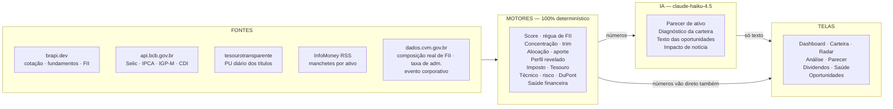

# InvestRadar — documentação funcional

O que a aplicação faz, com que dado, e por que ela acredita no que diz.

Este documento cobre a **superfície funcional inteira**: cada motor determinístico, onde a IA
entra, as doze telas e os limites conhecidos. Para os **prompts exatos** de cada ponto de IA,
ver [`analises-ia.md`](./analises-ia.md), que é o complemento deste. Para decisões de
arquitetura, gotchas de deploy e memória operacional do projeto, ver [`../replit.md`](../replit.md).

> **Este arquivo precisa ser atualizado junto com o comportamento que ele descreve.** Mudou um
> limiar, um peso, uma fonte de dado, uma tela ou um motor? A alteração só está completa quando
> este documento reflete o novo comportamento. Ver a seção "Manutenção deste documento" no fim.

**Superfície atual:** 61 endpoints · 21 motores determinísticos · 6 pontos de IA · 14 telas · 5 fontes externas.

---

## Os três princípios

Praticamente toda decisão de arquitetura sai de uma destas três regras. Elas não são
aspiracionais — cada uma tem consequência concreta no código.

**1. Dado que não existe não vira número.** Quando a fonte não tem a informação, a resposta é
`null` e a tela diz "indisponível". Nunca uma estimativa disfarçada de medição.

**2. A IA escreve o texto; ela nunca decide um número.** Score, status, nível de risco e
classificação são todos determinísticos. A IA recebe os valores já calculados e redige a leitura
em cima deles.

**3. Antes de calibrar, medir.** Mudar um limiar exige congelar os fundamentos do universo em
disco e rodar o motor velho e o novo sobre a mesma entrada.

O terceiro princípio nasceu de um erro real. A escala de score original ia de 0 a 100 no papel,
mas o universo inteiro cabia entre **43 e 74**, com 29% dos ativos empatados no mesmo número. Os
status `COMPRAR` e `VENDER`-por-fundamento **nunca dispararam** na vida do aplicativo. Ninguém
tinha percebido porque ninguém tinha medido.

**4. Sem base para afirmar, não se afirma.** O status `AGUARDAR` é a recusa de opinar, e vem
antes dos outros três — não é um estado entre `MANTER` e `VENDER`. O app produzia uma nota com a
mesma cara de confiança tendo visto três indicadores ou oito, e a partir dela dizia "Comprar".
Ver a seção própria abaixo.

---

## Como o dado atravessa a aplicação



A seta que importa é a terceira: a IA recebe números prontos e devolve apenas prosa. Ela **não tem
caminho de volta** para os motores.

Se a chamada de IA falhar, expirar ou a chave não estiver configurada, a seta de baixo continua
funcionando: as telas recebem os números e um texto determinístico de reserva. **Nenhuma tela
depende da IA para existir.**

---

## De onde vem cada dado

| Fonte | O que traz | Detalhe que importa |
|---|---|---|
| `brapi.dev` | Cotação, fundamentos, balanço e DRE, proventos, indicadores de FII, universo de tickers | O módulo pago `financialData` não expõe tudo; ROE, dívida/patrimônio e crescimento são **calculados** a partir do balanço e da DRE reais (padrão CVM) via os endpoints v2, não lidos prontos |
| `api.bcb.gov.br` | Selic, IPCA, IGP-M, CDI, dólar, rendimento real da poupança | Séries oficiais do Banco Central. A Selic é a referência contra a qual o rendimento de FII é lido, o CDI é a taxa livre de risco do Sharpe, e a série 195 já traz o rendimento da poupança com a regra de TR aplicada — pronto, sem reimplementar a regra |
| `tesourotransparente` | PU diário de todos os títulos do Tesouro Direto | Descoberto via CKAN — o endpoint JSON amplamente citado em tutoriais responde `410 Gone`. Ingestão incremental e de memória constante |
| InfoMoney RSS | Manchetes recentes por ativo | Título, link real do artigo e um resumo curto vindo do próprio `<description>` do feed (não é raspagem de página — é o campo que o publisher já disponibiliza pra syndication). A classificação de impacto é o único ponto em que a IA toca notícia |
| `dados.cvm.gov.br` | Composição real da carteira de FII (% imóveis diretos, % CRI/recebíveis, % outros), taxa de administração real, e a série mensal de cotas emitidas e amortização que alimenta o detector de evento corporativo | Informe Mensal Estruturado, dado público sem chave. O CNPJ vem cruzado com a brapi para a composição, e do `Codigo_ISIN` do próprio arquivo para o detector — que por isso não depende de plano pago. Diferente do investidor10.com.br (descartado por Termos de Uso), este é o próprio administrador prestando conta à CVM |
| `maisretorno.com` (opcional) | IFIX e CDI com histórico, dados D-1 | Entra só onde as outras fontes são cegas: o IFIX, que a brapi não devolve com série, e o CDI quando o BCB não responde. Sem `MAIS_RETORNO_TOKEN` o app funciona igual a antes — nada depende dela |

---

## O Score do Radar

A nota de 0–100 de cada ativo. Para ações sai de até oito indicadores fundamentalistas, mais
tendência de 12 meses e volatilidade. A nota final é a média ponderada **apenas do que existe de
verdade** para aquele ativo.

| Indicador | Origem | Faixa boa |
|---|---|---|
| P/L | `defaultKeyStatistics` | ≤ 15 |
| P/VP | `defaultKeyStatistics` | ≤ 1,0 |
| ROE | calculado: lucro ÷ patrimônio | ≥ 15% |
| Dívida / patrimônio | calculado: empréstimos ÷ patrimônio | ≤ 0,5 |
| Margem líquida | `defaultKeyStatistics` | ≥ 15% |
| Dividend yield | `defaultKeyStatistics` | ≥ 6% |
| Crescimento de receita | calculado: DRE ano a ano | ≥ 5% |
| Payout ratio | calculado: proventos 12m ÷ LPA | ≤ 60% |
| Tendência 12 meses | variação de 52 semanas | ≥ +20% |
| Volatilidade | beta | ≤ 0,7 |

### Duas correções que mudaram tudo

**Interpolação em vez de degraus.** As faixas antigas eram discretas — "P/L até 15 vale 90, de 15
a 25 vale 65". Isso dava a mesma nota para um P/L de 8 e um de 15, e derrubava 25 pontos por um
centavo de diferença. Hoje cada indicador interpola linearmente entre pontos de ancoragem que
*mantêm* as notas antigas nos mesmos limites: a mudança deu resolução entre eles, sem redefinir o
que é bom ou ruim.

**O "neutro" que não era neutro.** Notícias e macro valem 20% cada na fórmula original, mas não
têm fonte de dados. Entravam na média valendo um "60 neutro" — e 60 sobre 40% do peso total não é
neutralidade, é um ímã puxando todo mundo para o mesmo ponto. Foi a maior causa da escala
comprimida. Hoje ficam **fora** da média e os pesos restantes são renormalizados, mesmo critério
que os fundamentos já usavam para indicador ausente.

### Faixas de classificação

Calibradas sobre a distribuição real, não sobre números redondos escolhidos no papel.

| Faixa | Score | Ações do universo |
|---|---|---|
| Excelente | ≥ 88 | 6% |
| Forte | 82 – 87 | 12% |
| Estável | 65 – 81 | 67% |
| Atenção | 45 – 64 | 12% |
| Crítico | < 45 | 2% |

### O piso de evidência

Um ativo só recebe veredito com **pelo menos três indicadores reais**. A razão é concreta: os BDRs
chegam apenas com P/L, e o P/L que o provedor devolve para eles vem corrompido pela razão de
conversão do recibo — TSMC34 com P/L de 149.050, MSCD34 com 954, LILY34 com 2,6. Sem o piso, isso
produzia "Excelente / Comprar" e "Crítico / Vender" a partir de um número que não descreve a
empresa. Abaixo do piso a resposta é "dados insuficientes", que é a verdade.

O piso exclui os 25 BDRs e 7 ações de cobertura mínima. **Não toca nenhuma das 74 ações com
cobertura real**, que têm em média 6,9 indicadores cada.

### A triagem pré-compra diz "atende", nunca "compre"

O Parecer de Ativo responde à pergunta com um veredito explícito — **"atende ao corte de
compra do Radar"** ou **"não atende"** —, mostrando score e corte lado a lado. É uma afirmação
sobre a régua do app, não sobre o que a pessoa deve fazer, e a diferença é o que separa uma
ferramenta de uma recomendação de investimento.

Não reaproveita o COMPRAR/MANTER/VENDER da Análise de Ativos, e o motivo é concreto: aquele
status depende de quanto o ativo pesa na carteira, e para quem não tem posição o percentual é
zero — "MANTER" ou "VENDER" sobre algo que você não possui não quer dizer nada.

**Risco não derruba o veredito, e isso é uma escolha.** O TAEE11 pontua 83 (acima do corte de
82) carregando dois riscos sérios de caixa, e aparece como "atende" com os dois riscos logo
abaixo e um aviso de que eles não entram na conta. Reprovar por risco exigiria definir quais
são eliminatórios — e "alavancagem acima de 3x EBITDA" é o normal de transmissora e saneamento,
então o limiar genérico reprovaria setores inteiros por funcionarem como funcionam. Enquanto
isso não for medido, a honestidade está em mostrar as duas coisas lado a lado em vez de fundir
num rótulo só.

### Saúde financeira: entra na lista, não na nota

Cobertura do dividendo por caixa, alavancagem, conversão de lucro em caixa e liquidez corrente
viram **pontos positivos e riscos**, mas **não entram na média do score**. A separação é
deliberada nos dois sentidos.

Entram na lista porque escondê-los produzia telas que se contradiziam. O TAEE11 aparecia com
**6 positivos e zero riscos** — um deles "dividend yield acima da média do mercado" — enquanto o
parecer da IA ao lado dizia que o fluxo de caixa livre cobria 41% do dividendo e a dívida líquida
estava em 4,7x EBITDA. Bullet tem cara de fato, texto tem cara de opinião, e quem estava certo era
o texto. Medido em 18 ações com fundamentos reais: **10 ganharam ao menos um risco**, e três
(PETR4, TAEE11, VIVT3) saíram de *zero* riscos.

Não entram na nota porque **a medição disse para não entrarem**, e isso foi testado, não suposto.
O comparativo está em `artifacts/api-server/harness/health-score.mts`: congela os fundamentos das
90 ações do universo e roda o motor atual contra um candidato em que a saúde vira um quarto
componente da média.

O resultado, com peso 0,15 sobre 83 ações com fundamentos:

| setor | n | delta médio no score |
|---|---|---|
| **Energia** | 26 | **−4,6** |
| (sem setor) | 11 | −2,5 |
| Bens Industriais | 3 | −1,0 |
| Consumo Cíclico | 3 | −0,3 |
| Materiais Básicos | 9 | −0,1 |
| Serviços Financeiros | 15 | 0,0 |
| Consumo Não Cíclico | 5 | +1,4 |

A penalidade não se espalha pelo mercado: ela cai quase inteira em **Energia**, e os seis maiores
tombos são todos do setor (CMIG3/4, ISAE3/4, CPFE3, CPLE3). A faixa "Forte" encolhe de 10 para 4
ações e as seis que perdem o corte de compra são, em sua maioria, elétricas e transmissoras. Isso
não é medir saúde financeira — é medir intensidade de capital, que em utility regulada é o modelo
de negócio, não uma fragilidade.

Testada também a variante que compara alavancagem contra a **mediana do próprio setor**, na
hipótese de que o viés viesse da curva absoluta: Energia melhora de −4,6 para −3,4 e continua
quatro vezes pior que qualquer outro setor. O viés sobrevive porque não vem só da alavancagem —
cobertura de dividendo por caixa e conversão em caixa também são estruturalmente piores em quem
distribui muito e investe pesado.

Conclusão medida: **saúde financeira fica na lista de riscos, não na nota**. Ali ela faz o
trabalho — expor que o dividendo é pago com dívida — sem distorcer a comparação entre setores. O
harness fica no repositório para a decisão poder ser revista com dado novo, não com opinião.

Banco e seguradora ficam fora destes sinais por inteiro: o balanço deles é estruturalmente outro
(captação é passivo operacional, liquidez corrente gira perto de 1 por natureza), e aplicar os
mesmos limiares marcaria como risco o funcionamento normal do setor. Dois limiares merecem nome:
**1x de cobertura** é o ponto em que a empresa distribui mais caixa do que gerou, e **3x de dívida
líquida sobre EBITDA** é o patamar usual de covenant no crédito corporativo brasileiro. Quando o
caixa livre é negativo o aviso muda de frase em vez de virar percentual — "cobre −73%" não
significa nada, e o caso apareceu de verdade na verificação (SBSP3).

O elogio de cobertura também tem **teto**: acima de 10x o dividendo é irrelevante perto do
caixa gerado, e "coberto com folga" deixa de dizer algo sobre sustentação de provento. Também
não é hipótese — MGLU3 mediu **160x** de cobertura justamente porque havia cortado o provento
em 73%, e aparecia como ponto positivo numa empresa que estava reduzindo distribuição.

---

## A régua de FII, que é outra régua

Fundo imobiliário não pode ser medido pela régua de ação, e isso foi **medido, não suposto**. A
curva de ação trata dividend yield ≥ 6% como "acima da média do mercado" — quando a **mediana** dos
45 FIIs do universo é 12%. E trata P/VP ≤ 1 como desconto, quando a mediana do FII é 0,88.

O efeito era todos os FIIs espremidos entre 90 e 92, com apenas três valores distintos — e o
HCTR11, um fundo de papel cotado a 0,16 do valor patrimonial e com distribuição em queda, empatado
no topo com o HGLG11.

### As quatro dimensões — três delas sobre a distribuição

| Dimensão | Peso | Por que assim |
|---|---|---|
| Rendimento contra a **Selic líquida de IR** | 35% | Rendimento de FII é isento para PF; renda fixa não é. Comparar com a Selic cheia compararia líquido com bruto. Com a Selic a 14%, a referência justa é 11,9% |
| P/VP com curva de FII | 25% | Sobe até o desconto saudável (0,85–0,95) e cai *dos dois lados*. Em FII o valor patrimonial é laudo reavaliado — cota a uma fração dele é o mercado discordando do laudo, não pechincha |
| Regularidade dos pagamentos | 20% | Em quantos dos últimos 12 meses o fundo efetivamente distribuiu |
| Direção da distribuição | 20% | Últimos 6 meses contra os 6 anteriores. A janela de 12 meses não serve: o provedor cobre ~12 meses de histórico de FII, então uma comparação ano a ano responderia `null` para 40 dos 45 fundos |

### O guard de armadilha de yield

Quando a cota está muito descontada **e** a distribuição está encolhendo, o yield alto não é
mérito — é aritmética de preço caindo mais rápido que o rendimento. Uma média ponderada pura não
sabe expressar isso: ela somaria a nota alta do yield junto com a nota baixa do P/VP e o fundo
problemático sairia no meio da tabela. O motor detecta a combinação, tira o yield da conta de
méritos e diz o risco com todas as letras.

### O efeito, nos casos que motivaram a régua

| Fundo | Perfil | Antes | Depois | Leitura |
|---|---|---|---|---|
| MCRE11 | híbrido | 71 | 84 | Forte |
| MXRF11 | papel | 66 | 76 | Estável |
| HGLG11 | tijolo | 71 | 69 | Estável — rende 9,0%, abaixo da Selic líquida |
| HCTR11 | papel | 71 | 57 | Atenção — armadilha de yield detectada |
| TGAR11 | híbrido | 71 | 57 | Atenção — distribuição −28% no semestre |
| CPOF11 | híbrido | 66 | 42 | Crítico — pagou em 8 dos 12 meses |

A queda do HGLG11 é honesta e vale explicar: não é um fundo ruim, é que com a Selic a 14% a renda
fixa paga mais que os 9,0% dele. A aplicação passou a dizer isso em vez de esconder atrás de uma
nota alta.

### Segmento de FII contra o ciclo de juro — vira texto, nunca nota

`describeFiiInterestRateSensitivity` (`fii-engine.ts`) cruza o segmento do fundo com a tendência
real da Selic (`macro-data.ts`, série 432 do BCB) e alimenta o texto do parecer de ativo e do
parecer pré-compra — nunca o score, que continua vindo só da régua de FII acima. O mecanismo é
diferente por segmento: FII de papel sente no **canal de renda** — a distribuição sobe ou desce
acompanhando CDI/IPCA+ dos CRIs da carteira, junto com a Selic. FII de tijolo sente mais no **canal
de preço** — o mercado reprecifica a cota pela taxa de desconto do aluguel futuro, muitas vezes
antes mesmo do ciclo de corte se completar, enquanto o aluguel contratado segue intacto. Híbrido e
FoF **não recebem direção nenhuma**: a fonte de dados não expõe a proporção real entre papel e
tijolo na carteira desses fundos, e a régua entrega texto vazio (nenhuma linha aparece no prompt)
em vez de arriscar um palpite sem base.

### A composição real que o rótulo de segmento não mostra

`segmentType` (papel/tijolo/híbrido/FoF, via brapi) é uma **classificação**, não uma proporção. Dois
fundos híbridos podem estar em pontos opostos do espectro papel-tijolo e carregar o mesmo rótulo. O
Informe Mensal Estruturado da CVM (`dados.cvm.gov.br`, dado público, sem chave e sem restrição de
uso — a mesma fonte que qualquer administrador de FII é obrigado a alimentar todo mês) resolve isso
com número real: `getFiiCvmData` (`cvm-data.ts`) baixa o arquivo do ano, cruza pelo CNPJ real vindo
da brapi (`FiiProfile.cnpj`) e devolve três frações da carteira investida — **imóveis e direitos
reais diretos**, **CRI e recebíveis estruturados equivalentes** (papel) e **outros ativos
financeiros** (cotas de outros fundos, ações, SPEs) — mais a **taxa de administração real** cobrada
naquele mês sobre o patrimônio.

`Acoes_Sociedades_Atividades_FII` (cotas de SPE) fica de propósito fora dos dois primeiros grupos:
uma SPE pode deter imóvel ou papel, e o arquivo da CVM não diz qual — forçar numa categoria seria
inventar uma composição que a fonte não afirma, então cai em "outros" por diferença do total
reportado. Em um teste real (17/08), o MCRE11 — rotulado híbrido — apareceu com só 18% em imóveis
diretos e 48% em CRI, e a IA usou isso pra descrever o fundo como "mais próximo de um fundo de
crédito do que de tijolo, na prática" — exatamente o tipo de leitura que `describeFiiInterestRateSensitivity`
acima se recusa a fazer só com o rótulo de segmento, porque agora existe o número real por trás dele.

`describeFiiCvmComposition` (`fii-engine.ts`) devolve string vazia sem CNPJ do fundo ou sem o fundo
no informe mais recente da CVM — nunca mostra 0% de taxa de administração quando o dado simplesmente
não veio preenchido, o que seria dizer "gestão gratuita" sem base.

### Zonas de preço em R$ — a mesma régua, convertida em número

`computeFiiPriceZones` (`fii-engine.ts`) não inventa um preço-alvo: pega as duas curvas que a régua
de FII já usa pra pontuar — desconto saudável de P/VP (0,85–0,95) e prêmio de yield sobre a Selic
líquida (2–4 p.p.) — e converte os pontos de virada delas em R$, usando o VP/cota e o provento real
de hoje. Duas zonas, de propósito não combinadas numa única faixa: uma mede desconto patrimonial, a
outra mede renda exigida contra o risco-livre, e podem discordar entre si — combiná-las esconderia
esse desacordo.

Testado contra o CYCR11 em 18/08 (preço R$8,20, P/VP 0,87): a régua devolveu R$8,05–R$9,00 pela
curva de P/VP, quase idêntico à faixa de R$8,00–R$9,00 que uma análise externa detalhada (CRI por
CRI, devedor por devedor) chegou por conta própria — só que aqui é aritmética automática sobre uma
régua já medida contra o universo real, não uma segunda opinião.

### A mesma coisa para AÇÃO, por múltiplo normalizado contra o setor

`computeStockPriceZones` (`stock-price-zones.ts`) fecha a maior assimetria entre as duas réguas:
faixa de entrada em reais existia para FII e não para ação. Segue a mesma estrutura — **duas
leituras independentes que podem discordar**, e não uma média.

**Por lucro:** o múltiplo que o setor paga por lucro, aplicado ao lucro *normalizado* da companhia.
**Por patrimônio:** o P/VP do setor aplicado ao valor patrimonial por ação.

**Normalizado é a mediana de até cinco exercícios da CVM, não os últimos doze meses**, e a razão é
medida: o desvio-padrão do lucro anual é **70% da média** na companhia mediana, e **53% das
companhias tiveram ao menos um ano de prejuízo em cinco**. Avaliar pelo último exercício ancora a
conta num número que quase nunca representa a empresa. Mediana e não média porque um prejuízo grande
derruba a média — às vezes para o negativo — por causa de um único ano.

Quanto isso muda: a razão mediana normalizado/último é 0,93, mas **29% das companhias têm
normalizado abaixo de 70% do último ano** e 16% acima de 140%. Em 66 casos o sinal inverte — 27 com
último exercício positivo e mediana negativa —, e nesses o motor **não produz faixa**, em vez de
produzir uma com sinal trocado.

A faixa vai do múltiplo do **p25 do setor** (o que se paga pelas mais baratas) ao da **mediana** (o
que se paga por uma típica). Não há margem de segurança arbitrada: o intervalo é a dispersão medida
do próprio setor, recalculada a cada varredura semanal.

Das duas leituras, a de patrimônio é a mais firme, e isso também foi medido: sobre cinco exercícios,
a volatilidade do patrimônio líquido é **0,20** contra **0,70** do lucro. As duas aparecem lado a
lado; qual pesa mais é do leitor.

### Pares reais nomeados, não só a mediana

`describeSectorComparison` (`sector-benchmarks.ts`) compara P/L, ROE e DY contra a mediana do
setor — mas `Fundamentals` não carrega P/VP (é métrica de empresa; FII não tem P/L nem ROE), então
pra FII a comparação de fato útil, P/VP contra pares, nunca aparecia. `getFiiPeers`
(`sector-benchmarks.ts`) fecha isso: busca no `opportunities` (persistido semanalmente, mesma fonte
da mediana) até 3 fundos do mesmo segmento, com P/VP e DY reais vindos ao vivo de `getFiiProfiles`.
Limitação declarada, não escondida: só entram fundos que passaram no piso de elegibilidade da
última varredura — um par real do segmento pode ficar de fora por não atender liquidez/patrimônio
mínimo, não por não existir.

---

## Status: dois "Vender" que pedem coisas opostas

O badge de cada ativo cruza a nota com **quanto do patrimônio já está nele**. Score alto não é
sinal de compra: um ativo ótimo que já é metade da carteira não deve receber "Comprar" —
reforçá-lo aumenta o risco em vez de reduzir.

**VENDER por fundamento** (`score < 45`) — o argumento é sobre o **ativo**. Não existe quantidade
certa a vender: quanto reduzir de um papel cuja tese piorou depende de convicção, prazo e imposto,
que a aplicação não tem como decidir por ninguém.

**REDUZIR por concentração** (posição acima do limite crítico do perfil) — o argumento é sobre o
**tamanho**, e o ativo pode ser ótimo. Aqui existe resposta aritmética: a aplicação calcula quanto
vender em reais e em cotas para voltar à faixa saudável, e estima o imposto sobre essa fatia.

| Perfil | Atenção | Crítico |
|---|---|---|
| Conservador | 15% | 25% |
| Moderado | 25% | 40% |
| Arrojado | 30% | 50% |

Quando as duas condições disparam juntas, as duas são ditas: reduzir a posição não conserta
fundamento ruim, e reavaliar a tese não conserta concentração.

---

## Política de alocação e aporte direcionado

Você define — ou herda do perfil — uma política de percentuais por classe. A aplicação compara com
a carteira real e responde onde colocar o **próximo aporte**.

| Perfil | Renda fixa | Ações | FIIs | ETFs |
|---|---|---|---|---|
| Conservador | 80% | 10% | 6% | 4% |
| Moderado | 60% | 20% | 12% | 8% |
| Arrojado | 30% | 35% | 21% | 14% |

O percentual de renda fixa segue praxe consagrada. A divisão da parte variável (50/30/20) **não
é** — não existe consenso comparável — e o código diz isso explicitamente, para que ninguém
confunda convenção com lei.

O algoritmo é *water-filling*: dado um valor de aporte, calcula o déficit de cada classe frente ao
alvo e preenche primeiro as mais defasadas, até nivelar. A consequência prática é que a sugestão
**nunca manda vender** para rebalancear — ela só direciona dinheiro novo, que é a forma de
rebalancear sem gerar imposto nem custo de corretagem.

Fatias abaixo de um piso são absorvidas pelas demais: sugerir aplicar oito reais em uma classe
seria ruído, não orientação. O piso é R$ 50 — ou 10% do aporte, quando o aporte é pequeno demais
para que R$ 50 faça sentido como fatia mínima.

**De reais para quantidade.** O plano parava no valor por classe e listava os candidatos, deixando
a divisão por conta do usuário. Agora cada candidato mostra quantas ações, cotas ou frações de
título a fatia compra, com a cotação usada e o que sobra — bolsa em unidades inteiras (o mercado
fracionário negocia a partir de 1), Tesouro em múltiplos de 0,01 título respeitando o piso de R$ 30.
Nada arredonda para cima, e sem cotação real a linha simplesmente não aparece.

A fatia inteira é medida contra **cada** candidato, não rateada entre eles, e a tela diz isso: o
alvo do app é por classe, não por ticker, então dividir entre os três seria inventar uma política
que não existe. Quando a fatia não paga uma unidade, o app diz isso em vez de omitir a linha —
é informação que ele tem.

---

## Perfil declarado contra perfil revelado

O questionário mede o que você *diz*. A aplicação tem algo que nenhum questionário entrega: a sua
alocação de fato. As duas leituras convivem, e a divergência entre elas é o dado mais interessante.

**Declarado** — separa **capacidade** (horizonte 35%, reserva de emergência 25%, necessidade de
liquidez 20%) de **tolerância** (reação a perda, objetivo, experiência), como a literatura de
suitability trata. A régua anterior somava cinco respostas de peso igual, o que permitia que
restrições absolutas fossem diluídas: quem respondia horizonte curto, tolerância baixa e precisa de
liquidez, mas também "crescimento" e "avançado", saía como Moderado — três sinais de Conservador
anulados por dois que não medem risco.

**Revelado** — calculado sobre a alocação de verdade: peso em renda variável, concentração no maior
ativo, beta médio ponderado. Quem se declara Moderado mas tem 44% do patrimônio em um único ativo
cíclico **está operando como Arrojado**. Se faltar preço ou beta para um ativo, o fator sai da
conta em vez de ser estimado.

---

## As camadas de leitura por ativo

Além do score, cada ativo carrega seis análises independentes. **Nenhuma delas entra na nota** —
são leituras paralelas, para não contar o mesmo fundamento duas vezes.

| Camada | Fonte | O que entrega | Quando falta dado |
|---|---|---|---|
| **Análise técnica** | séries diárias reais | SMA 20/50/200, RSI 14, MACD com sinal e histograma, Bandas de Bollinger com posição do preço. Detecta cruzamento dourado e da morte | SMA 200 exige 200 candles; ticker novo devolve `null`, nunca média estimada |
| **Risco ajustado** | retornos diários · CDI real | Retorno anualizado, volatilidade, desvio de downside, Sharpe, Sortino e Treynor. A taxa livre de risco é o CDI acumulado do mesmo período, não uma constante | Sortino `null` sem retorno negativo; Treynor `null` sem beta |
| **Decomposição DuPont** | balanço + DRE, 6 insumos | Abre o ROE em carga tributária, carga de juros, margem EBIT, giro de ativos e alavancagem, e aponta qual domina | Só calcula com os seis insumos presentes; nunca parcial |
| **Saúde financeira** | módulo `financialData` | Cobertura do dividendo pelo caixa livre, conversão de lucro em caixa, liquidez corrente, margem EBITDA, dívida líquida/EBITDA | Para bancos e seguradoras o balanço é estruturalmente diferente; o motor sinaliza isso no texto para a IA não ler como empresa comum |
| **Qualidade da distribuição** | histórico real de proventos | Cadência do ativo (mensal/trimestral/…), regularidade **normalizada por essa cadência** e direção da distribuição. Neutro entre classes de propósito: a régua de FII mede "pagou em N dos últimos 12 meses", o que reprovaria qualquer ação — um FII mensal 12/12 e uma ação trimestral 4/4 valem o mesmo aqui, e quem cai é quem falha na própria cadência | Sem provento em 12 meses, não há veredito. Renda fixa fica fora: o app não rastreia cupom como evento |
| **Prêmio de dividendo** | yield × mediana do grupo | Ordena ativos entre si para "onde vai o próximo aporte". Yield puro premiaria armadilha; Gordon não se sustenta com 12 meses de histórico | — |
| **Benchmark setorial** | mediana do setor, amostra ≥ 3 | Compara P/L, P/VP, ROE, yield e margem contra a **mediana** — não a média. Com amostra pequena um extremo distorce | Setor com menos de 3 ativos fica fora da tabela |

---

## Cadastro de ativo: consolidação e validação de ticker

Comprar mais de um ticker que já está na carteira **consolida na mesma linha** em vez de criar uma
posição nova — soma a quantidade e recalcula o preço médio ponderado, igual a qualquer corretora
faria (`POST /assets`, `routes/assets.ts`). A consolidação exige ticker **e** categoria idênticos à
posição existente; ticker sozinho não basta, porque o mesmo papel jamais deveria ter preço médio
misturado entre categorias diferentes.

O número é o mesmo de sempre, mas deixou de ser um `update` que sobrescreve o anterior: consolidar
agora é **consequência** de registrar mais um lançamento e reproduzir a posição inteira — ver a
seção abaixo.

Essa exigência de igualdade exata tem um lado frágil: um erro de digitação no ticker ("DVF11" em vez
de "DVFF11", por exemplo) não dá erro nenhum — vira uma posição de verdade, só que sem cotação, sem
provento, sem nada, e nunca se junta com a posição correta porque as strings são diferentes. A pessoa
só percebe quando repara em dois cards do "mesmo" ativo, um deles preso em "Em breve" com cotação
sempre em branco.

**Validação de ticker** (`GET /assets/validate-ticker`) existe pra pegar isso ANTES de virar posição.
No formulário de cadastro, 500ms depois de parar de digitar, o app confere se o ticker tem cotação
real (mesmo `getQuotes` que qualquer outra tela usa) e mostra o nome do ativo encontrado — ou um aviso
de que nada foi encontrado. Tentar salvar com um ticker não encontrado não bloqueia pra sempre (o
ticker pode ser real e só ainda não coberto pela fonte de dados): o primeiro clique avisa e não
salva, o segundo, com o mesmo ticker, prossegue. Só roda para categorias cotadas — Tesouro Direto já
tem sua própria validação por família+vencimento (`findTreasuryBond`), e renda fixa privada não tem
ticker de mercado pra checar. No formulário de edição o ticker vem travado (não digitável), então o
risco de digitação só existe no cadastro.

**Categoria conferida pelo sufixo da B3.** O ticker existir não prova que ele é da classe escolhida,
e o app deixava cadastrar PETR4 como FII. Classe errada não é rótulo: ela decide alíquota de IR,
isenção de provento, limiar de concentração e em qual fatia da alocação-alvo a posição entra.
`lib/b3-ticker.ts` lê o próprio código de negociação — 3 a 8 é ação, 31-35 e 39 é BDR — e bloqueia a
combinação que a convenção **prova** estar errada, no mesmo aviso da validação de ticker e de novo no
servidor.

O que ela não decide fica sem resposta de propósito: o sufixo **11 é FII, ETF *e* unit de ação**
(MXRF11, BOVA11, BPAC11), então as três categorias passam. Silêncio ali significa "a regra não prova
que está errado", nunca "categoria confirmada" — inventar uma resposta rejeitaria cadastro legítimo,
e o dano de bloquear o que é válido é maior que o de deixar passar o duvidoso. Renda fixa e fundos
ficam inteiramente fora da regra, porque ali o identificador é CDB, título público ou nome de fundo.

**Travas de faixa.** Quantidade e preço precisam ser maiores que zero, e a data de operação precisa
estar entre 1900 e hoje. As duas nasceram do mesmo cadastro real: quantidade −10, preço R$ 0,00 e
data em 26/01/0001, que produzia patrimônio **negativo** na carteira inteira. O `<input type="date">`
aceita ano 0001 sem reclamar — basta digitar "1" no campo de ano.

O que a assimetria revelou: o registro de lançamentos já recusava quantidade negativa, mas
`POST /assets` — que grava um lançamento igual, na mesma tabela — não recusava. A porta nova estava
guardada e a antiga não. Zero em `averagePrice` continua válido num único caso, e ele é explícito no
código: poupança, onde o campo é **saldo** e sacar tudo é operação real.

### Lançamentos: o preço médio deixou de ser um número digitado

`assets.average_price` era um valor que alguém digitava, sem procedência e sem como conferir. O
custo disso apareceu inteiro numa investigação real: uma posição de DVFF11 mostrava R$ 5,68 contra
R$ 5,04 na corretora, e foram necessárias **três hipóteses erradas** — amortização (descartada com
51 meses de dado da CVM), desdobramento (real, mas de 2023, anterior à compra) e uma compra antiga
a R$ 5,68 (impossível: o papel nunca negociou nessa faixa na janela) — até a nota de corretagem
mostrar que era simples erro de digitação no cadastro.

Agora cada compra é um lançamento (`asset_purchases`), e quantidade, preço médio e data de compra
são **calculados** a partir deles. Nenhuma das três hipóteses teria sido necessária.

**Só compra entra na tabela.** Venda já é conceito de primeira classe em `sales`, com IR e resultado
realizado na tela "Operações Encerradas", e a regra brasileira é que venda não altera preço médio —
só reduz quantidade. Duplicá-la criaria duas verdades sobre o mesmo fato.

**As três colunas de `assets` continuam existindo, como CACHE.** São lidas em cerca de trinta
lugares — totais, distribuição, saúde, alocação, meta de renda, proventos, score, IR, TWR, risco,
perfil revelado, prompts de IA e o frontend inteiro — e nenhum deles reconstrói histórico. Fazer
todos calcularem a partir dos lançamentos seria reescrever meia aplicação para resolver um problema
que é de escrita. Do lado da escrita o quadro se inverte e é o que torna o cache seguro: as sete
mutações de posição vivem todas em `routes/assets.ts`, e a regra passa a ser que **nenhum `update`
de quantidade ou preço médio existe fora de `recomputeAssetCache`**.

**Editar a posição edita o lançamento inicial.** Enquanto só existe o saldo informado, o diálogo se
comporta como sempre. A partir do primeiro lançamento real, quantidade, preço médio e data ficam
somente-leitura: a correção passa a ser na linha errada, não no total. Sem isso o cache voltaria a
poder divergir da fonte, reabrindo exatamente a porta que o recurso fecha.

**Poupança fica de fora, e a exceção é explícita.** Ali `quantity` é sempre 1 e `average_price` é o
**saldo**, não preço de compra. Lançamento de compra não descreve nada, e o diálogo "Movimentar
Poupança" grava pelo mesmo `PATCH /assets/:id` — se o desvio para lançamento valesse pra todo mundo,
depósito e saque quebrariam.

**Posições anteriores ganham um lançamento de saldo inicial**, marcado como tal — não é uma nota de
corretagem, é o que a pessoa informou, e a interface diz isso. O backfill confere posição por
posição e falha se alguma divergir: o TWR deriva fluxo da variação de custo entre snapshots, então
um backfill que mexesse no custo faria a diferença aparecer como **aporte retroativo**, mudando
sozinha a rentabilidade histórica já gravada.

Fica de fora, deliberadamente: reescrever o TWR para usar fluxo exato (destravado por isto, mas é
outro trabalho), IR por lote (o app usa preço médio, que é a regra brasileira padrão) e aplicar
evento corporativo aos lançamentos.

---

## Imposto de renda sobre ganho de capital

Implementa a Lei 11.033/2004 e a IN RFB 1.585/2015. É lei tributária real, não heurística da
aplicação — e o código marca isso, para que uma mudança da Receita seja tratada como atualização
normativa e não como ajuste de fórmula.

| Classe | Alíquota | Isenção |
|---|---|---|
| Ações (operação comum) | 15% | Isento se o total vendido no mês ficar em até R$ 20.000 |
| FIIs | 20% | Sem isenção sobre ganho de capital |
| ETFs | 15% | Sem isenção |
| BDRs | 15% | Sem isenção |

Duas contas diferentes: uma **estimativa por venda**, que aparece junto da sugestão de redução para
você saber o custo antes de decidir; e uma **consolidação mensal**, que aplica compensação de
prejuízo — e essa precisa respeitar a ordem cronológica, porque prejuízo só compensa para frente.

---

## Tesouro Direto marcado a mercado

Títulos públicos não são cadastrados como texto livre. A aplicação identifica o título pelo par
**tipo + vencimento**, deriva um ticker canônico e marca a posição a mercado com o PU diário
oficial.

- **PU de venda, não de compra.** A marcação usa o preço de resgate, que é o que você receberia
  hoje. A diferença não é acadêmica: no IPCA+ 2050 o spread chegou a 2,66%.
- **Preenchimento automático.** Informando data da compra e valor investido, a aplicação busca o PU
  daquele dia e calcula a quantidade — inclusive fracionária.
- **Sugestão por objetivo.** Quem precisa de liquidez ou não tem reserva de emergência recebe
  Tesouro Selic, porque é o único cujo resgate antecipado não sofre marcação a mercado.

### Parecer de Título Público — a mesma série histórica, respondendo outra pergunta

Parecer de Ativo (`GET /analysis/treasury-opinion`) aceita título do Tesouro Direto, não só ticker
cotado. Não existe score aqui — renda fixa pública não tem fundamento pra comparar ENTRE títulos
como ações têm entre si — então a pergunta que dá pra responder é mais estreita: a taxa de compra de
hoje deste título está boa contra a própria faixa recente dele (mín./máx./média dos últimos 90
dias-base, calculada sobre a mesma série histórica de `treasury_bonds` que já alimentava marcação a
mercado e sugestão de aporte) e contra o cenário de juro atual (Selic, IPCA 12m e juro real, via
`getMacroSnapshot`). Sem IA: todo campo é número real ou texto determinístico sobre ele. Faixa
`null` quando a janela de 90 dias tem menos de 15 dias-base publicados — histórico curto demais pra
uma faixa confiável, em vez de calculada em cima de poucos pontos.

### Poupança — sub-tipo de renda fixa, não categoria própria

Poupança entra como uma terceira variante dentro de `renda_fixa` — ao lado de Tesouro Direto
(`treasuryBondType`) e renda fixa privada (ticker livre) — marcada pelo booleano
`isSavingsAccount`, não por uma categoria nova. A decisão é deliberada: poupança deveria somar na
mesma fatia de alocação que Tesouro e CDB, não abrir uma classe própria em toda tela que já itera
sobre categoria (distribuição, alocação-alvo, saúde do portfólio).

Não existe cotação nem PU pra poupança — só um saldo que rende uma vez por mês, no aniversário do
depósito. `quantity` fica travada em 1; `averagePrice` guarda o saldo que a pessoa informou;
`purchaseDate` guarda a DATA desse saldo, não a data de abertura da conta. A partir desses dois,
`savings-engine.ts` projeta o saldo de hoje usando a série 195 do Banco Central (SGS) — o
rendimento REAL da poupança, já com a regra oficial de TR aplicada (TR + 0,5% a.m. com Selic acima
de 8,5% a.a.; TR + 70% da Selic nos demais casos), publicado por dia-aniversário. Não reimplementamos
essa regra — o BCB já publica a taxa final pronta.

O motor só compõe ciclos mensais **já fechados**: poupança não rende accrual linear entre
aniversários — sacar antes do aniversário fechar não dá direito a nada daquele ciclo, e mostrar um
valor pro-rated seria inventar um número que o banco não creditou. O saldo fica parado desde o
último aniversário até o próximo fechar. A regra oficial dos dias 29/30/31 (aniversário desses
depósitos cai sempre no dia 1º do mês seguinte, porque nem todo mês tem esses dias) também é
respeitada.

Limitação honesta, a mesma de renda fixa privada: o app não sabe de depósitos e saques feitos entre
uma consulta e outra. Reenviar o cadastro com o mesmo nome de conta não soma como uma segunda
compra (isso produziria uma média ponderada sem sentido pra saldo) — substitui saldo e data pelos
novos, o mesmo efeito de editar a posição.

Pra não exigir que a pessoa calcule o novo saldo de cabeça a cada depósito ou saque, o botão de
cifrão da linha (que em outras classes abre "Vender") abre, pra poupança, o diálogo "Movimentar
Poupança": mostra o saldo estimado de hoje, deixa escolher depósito ou saque e valor, e calcula o
novo saldo/data sozinho antes de enviar pro mesmo `PATCH /assets/:id` que a edição manual já usa —
nenhuma rota nova. Optei por não rastrear cada depósito como um lote com aniversário próprio (o que
seria necessário pra modelar com exatidão o caso de um saque parcial antes do fechamento do ciclo);
o ganho aqui é só de UX sobre o mesmo modelo de saldo único já existente, com a mesma aproximação e
o mesmo aviso de honestidade sobre precisão perto da data de crédito.

### Evento corporativo em FII — avisa, não corrige

O preço médio guardado aqui é o que a pessoa informou. A corretora recalcula o dela a partir das
notas de corretagem **e ajusta por evento corporativo**; o app não ajusta nada. Enquanto nada
acontece com o fundo os dois números batem. Quando acontece, o app diverge **em silêncio** — foi
assim que uma divergência real (app R$ 5,68, corretora R$ 5,04) passou despercebida até aparecer no
extrato, num FII que tinha sofrido desdobramento 1:10.

O detector lê `fii_monthly_reports` e avisa quando o fundo passou por um evento **depois** da data
de compra registrada. Só entram eventos que **sempre** alteram o preço médio de quem já tinha a
posição:

- **Desdobramento e grupamento** — detectados por razão inteira entre a quantidade de cotas de dois
  meses consecutivos (2, 3, 4, 5, 8, 10, 20, 25, 40, 50 ou 100, com 2% de tolerância). A lista é
  explícita porque o arquivo tem lixo: existe fundo com razão de ×262.600 entre dois meses, que é
  erro de preenchimento e não evento societário.
- **Amortização** — só acima de **1% acumulado** desde a compra. Amortização mensal típica é da
  ordem de 0,18%; avisar a cada mês seria ruído.

**Variação de cotas que não bate razão inteira é deliberadamente ignorada.** É emissão nova, que não
mexe no preço médio de quem não subscreveu — e é de longe a mais comum: medindo 2022–2026, 64% dos
FIIs (1.023 de 1.602) tiveram alguma variação, 6.049 ocorrências. Alertar nisso seria alarme falso
em dois terços de qualquer carteira. Filtrando por razão inteira sobram 164 fundos e 198 eventos.

Duas armadilhas do arquivo da CVM que custaram bug e viraram teste de regressão:

1. **Os campos `Percentual_*` são fração, não percentual**, apesar do nome. Provado por igualdade
   exata: `Percentual_Dividend_Yield_Mes` de 0,0074884 vezes o valor patrimonial da cota de 8,6801
   dá R$ 0,0650 — exatamente o rendimento pago naquele mês. Dividir por 100 "corrigindo" o nome
   tornaria o limiar de amortização inalcançável e o detector silenciaria sem avisar ninguém.
2. **A coluna do CNPJ mudou de nome**: até 2022 é `CNPJ_Fundo`, de 2023 em diante
   `CNPJ_Fundo_Classe`. Ler só o nome novo fazia o backfill descartar os anos antigos inteiros
   retornando zero linha, sem erro nenhum.

Ticker → CNPJ sai do `Codigo_ISIN` do próprio arquivo (DVFF11 → prefixo `BRDVFFCTF`), o que dispensa
o plano pago da brapi que o outro caminho do app usa. O ISIN é preenchido de forma inconsistente
entre anos — o DVFF11 vem vazio em todo o ano de 2023 e preenchido em 2026 —, então a busca varre a
tabela inteira: basta um mês qualquer trazer o ISIN pra que a série toda do fundo fique alcançável.

O aviso aparece como triângulo âmbar ao lado do ticker em Minha Carteira, na linha onde o preço
médio está escrito, e não como alerta no Radar — o questionamento vale mais colado no número que ele
questiona. Sem a sincronização ter rodado, a tabela está vazia e ninguém recebe aviso: silêncio
honesto, nunca palpite.


### O perfil declarado calibra o texto, nunca o veredito

O questionário de perfil guarda objetivo, horizonte, tolerância a perda, experiência, necessidade
de liquidez, reserva de emergência, estabilidade de renda e que fatia do patrimônio esta carteira
representa. Durante muito tempo **só `classification` era aproveitado** — o app lia a linha inteira
para derivar os limiares de concentração e descartava o resto. O efeito era um parecer idêntico
para quem acumula com trinta anos pela frente e para quem já vive da renda da carteira.

Agora o perfil entra no prompt dos dois pareceres. Medido com o mesmo ativo, mesmo score e mesma
concentração de 32%, mudando só o perfil:

- **Conservador, renda, horizonte de 2 anos, sem reserva de emergência** → a leitura abre pela falta
  de reserva, liga isso a risco de venda forçada e trata reduzir a concentração como prioridade
  prática.
- **Arrojado, crescimento, horizonte de 25 anos, com reserva** → a mesma concentração vira
  recomendação de direcionar novos aportes para outros ativos, "não vender à força".

O **status continuou MANTER nos dois**, que é a regra que não se negocia: o perfil calibra tom e
prioridade, e a régua determinística segue decidindo score e status sozinha. A diretriz que diz
isso está no próprio prompt (`PROFILE_PROMPT_GUIDANCE`) e é verificada por teste — se ela sumir, o
perfil deixa de ser calibragem e passa a poder contaminar o veredito.

Campo não preenchido não vira linha. "Horizonte não declarado" e "horizonte curto" levam a
conselhos opostos, e chutar entre os dois seria pior que omitir. Sem perfil nenhum, o prompt fica
exatamente como era antes.

### Carteira de Partida — a primeira tela útil de quem ainda não tem nada

Quem acaba de se cadastrar encontrava a aplicação inteira respondendo a mesma coisa: vazio. A
mensagem de carteira vazia mandava "adicionar ativos para começar" **sem dizer quais** — que é
exatamente a pergunta em que a pessoa está travada.

A tela mostra as três carteiras-alvo **lado a lado**, e não uma. Mostrar uma exigiria adivinhar o
perfil de quem ainda não respondeu o questionário; e o contraste entre 80% e 30% de renda fixa é a
explicação mais curta que existe do que o questionário decide. A tela não calcula nada por conta
própria: `defaultPolicyFor` dá os pesos, `rankOpportunitiesFor` + `orderByRiskProfile` dão os
candidatos por classe na ordem de risco de cada coluna, `planContribution` converte em reais quando
o usuário informa um valor de partida, e `suggestTreasuryBonds` dá o título.

O trabalho de projeto que ela acrescenta é **hierarquia entre números que não valem a mesma coisa**,
e a tela diz isso em texto:

| O número | De onde vem | Como aparece |
|---|---|---|
| Renda fixa × variável (80/60/30) | Praxe de mercado — ponto médio das faixas por perfil | O número grande da coluna |
| Ações 50 / FIIs 30 / ETFs 20 | Convenção deste app, **não** praxe consagrada | Abaixo e menor, com o rótulo dizendo que é convenção e editável em Saúde do Portfólio |
| Os tickers | Varredura vigente, ordenada pelo risco do perfil | "Candidatos para estudar, não recomendação de compra" |

**O título do Tesouro é um só para as três colunas**, e essa é a demonstração mais concreta do que o
questionário entrega. Ele não depende da classificação de risco: `suggestTreasuryBonds` escolhe por
liquidez, reserva de emergência e horizonte. Sem questionário respondido o motor cai no Tesouro
Selic e justifica com "sem horizonte declarado no perfil" — o que muda entre as colunas é *quanto*
vai para renda fixa; *qual* título só o questionário resolve. Respondido o questionário, a sugestão
passa a citar o horizonte real, e continua sendo uma só. Por isso `treasury` viaja **fora** do array
de perfis na resposta: a forma do JSON afirma que ele não varia por coluna.

Duas coisas a tela deliberadamente não faz. Não existe botão de "criar estes ativos na minha
carteira": gravaria posição que a pessoa não comprou, com preço e data inventados — exatamente o que
o registro de lançamentos eliminou. E não há IA nenhuma aqui: é composição estática de saída de
motor, e um LLM só acrescentaria latência na primeira tela do aplicativo.

Piso por fatia herdado do plano de aporte: num começo de R$ 300 a fatia de ETF não alcança o mínimo,
some do plano, e o valor dela é redistribuído. A tela diz isso na própria classe em vez de exibir
R$ 0,00 sem explicação — e o valor da renda fixa exibido é o que o motor de fato alocou, não o
percentual multiplicado pelo total, que divergiria justamente nesse caso.

---

## Meta de renda passiva

Você define quanto quer receber por mês. A aplicação calcula quanto falta de capital e qual aporte
mensal chega lá — tudo em cima de dado real: a renda projetada vem dos proventos *efetivamente
pagos* nos últimos 12 meses, e o yield usado para dimensionar o capital faltante é o da sua própria
carteira, não uma taxa de referência.

O cálculo é feito **sem** reinvestimento dos proventos. Reinvestir acelera bastante o percurso, mas
projetar isso exigiria assumir que o yield atual se mantém por todo o período — e o erro cairia do
lado otimista, dizendo que basta menos do que de fato basta. A escolha é errar para o lado seguro.

---

## Número Mágico — e por que ele nunca pede pra concentrar

**Número mágico** (`magic-number-engine.ts`) é quantas cotas de UM ativo faltam pra ele se
autossustentar: o dividendo médio real que a posição paga já compra mais uma cota dela mesma, no
preço atual.

```
número mágico = preço atual ÷ (soma real dos proventos pagos nos últimos 12 meses ÷ 12)
```

Não é uma meta fixa — preço e dividendo mudam todo mês, então o número recalcula a cada consulta.
Sem provento real pago nos últimos 12 meses (a maioria das ações de crescimento, por exemplo), a
tela mostra "—", nunca um número estimado.

**O risco que motivou a segunda parte da conta**: perseguir o número mágico de um ativo isolado
empurra a aportar cada vez mais nele mesmo, o que pode furar o teto de concentração do perfil
(`concentrationLimitsFor`, a mesma régua de "Status: dois 'Vender'" acima) — só que hoje aquela régua
só **alerta depois** de já ter concentrado. Número Mágico aplica o mesmo teto **pra frente**, como
plano: calcula quantas cotas dá pra comprar agora sem estourar a faixa "Atenção" do perfil e, se o
número mágico pedir mais do que isso, não empurra o aporte além — mostra só o que é seguro comprar
hoje, e diz que o resto depende do patrimônio total crescer com aportes em **outros** ativos, não de
reforçar mais este. Concentração é uma razão (posição ÷ patrimônio total); crescer o denominador
libera espaço no numerador sem violar o limite. Mais devagar, mas nunca sugerindo concentração por
debaixo dos panos.

Quando a posição já está no teto ou acima dele, a tela mostra isso com todas as letras em vez de
sugerir zero cotas em silêncio — o app diz por que não é seguro comprar mais nela agora.

---

## Onde a IA entra — e o que ela não decide

Seis pontos. Os dois que cruzam mais sinais ao mesmo tempo (parecer de ativo e parecer pré-compra)
rodam em `claude-sonnet-5`; os quatro restantes — classificação simples ou geração em lote sobre
dezenas de tickers — continuam em `claude-haiku-4-5-20251001`, onde o ganho de qualidade não paga o
custo/latência extra. Os prompts exatos estão em [`analises-ia.md`](./analises-ia.md).

| Ponto | Recebe | Devolve | Decide |
|---|---|---|---|
| **Parecer de ativo** | Score, positivos, riscos, notícias, macro, imposto, concentração, **perfil declarado do investidor**, técnico, DuPont, saúde financeira, zonas de preço e pares reais de FII | 2–6 frases de leitura cruzada | **nada** |
| **Parecer pré-compra** | O mesmo conjunto, sem posição | 2–6 frases | **nada** |
| **Diagnóstico da carteira** | Score de saúde e as 5 dimensões, composição, macro | 3–6 frases interpretando sem repetir os números | **nada** |
| **Narrativa de mercado** | Janelas de variação, atribuição por contribuição, manchetes reais, macro | 2–4 frases, com permissão de dizer "não sei" | **nada** |
| **Texto das oportunidades** | Score, fundamentos, segmento do FII | Motivo, positivos, riscos, horizonte | **nada** |
| **Impacto de notícia** | A manchete | Positivo / neutro / negativo | só o rótulo |

### As quatro defesas

1. **O prompt proíbe explicitamente** inventar dado fora da lista recebida e propor score
   diferente do calculado.
2. **A saída estruturada é validada antes de ser usada.** No texto das oportunidades, o JSON passa
   por checagem de tipo campo a campo — qualquer falha cai no texto determinístico do motor, sem
   quebrar o processamento.
3. **Sem chave de API, nada quebra.** Todas as funções retornam `null` e as telas usam o texto
   determinístico. A ausência da IA degrada a prosa, não a função.
4. **As duas garantias mais frágeis têm teste de regressão contra a API real.**
   `harness/ai-guardrails-check.mts` roda os quatro prompts mais arriscados (parecer de ativo,
   parecer pré-compra, diagnóstico da carteira, narrativa de mercado) com cenários fixos —
   inclusive o caso que já falhou uma vez (ver abaixo) — e verifica que a IA não emenda uma causa
   inventada quando não sabe, e que nenhum score fora dos fornecidos aparece na saída. Não é um
   gate de CI, é um spot-check pra rodar depois de editar qualquer um desses quatro prompts; sem
   ele, a garantia (2) do parágrafo anterior nunca era verificada de novo depois da primeira vez.

O enum de nível de risco é o exemplo mais claro da separação: é derivado do beta real por
comparação numérica direta. A IA escreve o texto *em volta* dele, mas nunca o escolhe.

### Manchete clicável — o link real que já existia e ficava sem uso

O RSS do InfoMoney sempre trouxe o link de cada notícia (`NewsHeadline.link`, `news.ts`), mas a
rota que monta a resposta da API achatava `{título, link, impacto}` num único texto formatado
("[Positivo] título") antes de devolver — o link nunca chegava na tela, e a manchete não tinha
como ser clicável por mais que o dado existisse por baixo.

Corrigido expondo `newsItems` como objeto estruturado (`title`, `impact`, `link`, `summary`) em vez
de string solta, em Análise de Ativos e Parecer de Ativo. Cada manchete agora abre um modal com o
**resumo real** do próprio `<description>` do RSS — não é raspagem de página, é o campo que o
InfoMoney já publica pra syndication — e um botão pra ler a matéria completa. O resumo é limpo de
HTML e do rodapé que o WordPress cola em toda entrada ("The post ... appeared first on
InfoMoney.") antes de chegar na tela.

Limitação honesta: o resumo do RSS é uma frase curta pensada pra fazer o leitor clicar, não a
matéria inteira — não é onde o valor exato de um provento aparece. Pra isso, o link pra matéria
completa continua sendo o caminho.

Uma linha antiga persistida em `analyses.news_items` (formato string, de antes desta mudança)
continua parseável — degrada pra sem link/resumo em vez de quebrar a tela — e é substituída pra
sempre na próxima geração (`POST /analysis/generate` sobrescreve a tabela inteira).

---

## As doze telas, e a pergunta que cada uma responde

| Tela | A pergunta | O que mostra |
|---|---|---|
| **Dashboard** | Como estou, no geral? | Patrimônio, resultado sobre o custo, **carteira contra o mercado e quem puxou o resultado**, dividendos acumulados, yield da carteira, evolução patrimonial, alocação por categoria, comparativo contra benchmarks, oscilação da composição atual |
| **Minha Carteira** | O que eu tenho? | Posições com preço atual, resultado, status de cada ativo, e o cadastro — incluindo Tesouro Direto com preenchimento automático, poupança com saldo projetado pelo rendimento real do BCB, e a data da compra, opcional em qualquer classe, editável depois |
| **Carteira de Partida** | Não tenho nada ainda — por onde começo? | As três carteiras-alvo (Conservador/Moderado/Arrojado) lado a lado, com candidatos por classe e o título do Tesouro; opcionalmente convertidas em reais a partir de um valor de partida |
| **Importar Nota** | Já invisto — como trago o que tenho sem digitar tudo? | Nota de corretagem e extrato de custódia em PDF conciliados numa tela de conferência; grava só o que você marcar, e só compra |
| **Radar Inteligente** | O que mudou e eu preciso saber? | Alertas de concentração, preço, fundamentos, notícias e macro, com severidade |
| **Análise de Ativos** | O que penso do que já tenho? | Score, classificação, status, positivos e riscos, indicadores técnicos, parecer da IA |
| **Parecer de Ativo** | Devo comprar isto que ainda não tenho? | Triagem "atende / não atende ao corte", análise completa de qualquer ticker sem exigir posição, range de 52 semanas, tendência de proventos, comparação setorial — e, pra Tesouro Direto, taxa de hoje contra a própria faixa dos últimos 90 dias e contra Selic/IPCA atuais |
| **Oportunidades** | O que existe lá fora? | Universo de ~180 tickers varrido semanalmente, reordenado pelo nível de risco compatível com o perfil |
| **Dividendos** | Quanto recebo, e caminho para a meta? | Total acumulado, yield on cost, histórico de 12 meses, proventos anunciados, progresso da meta, número mágico por ativo com plano seguro de concentração |
| **Operações Encerradas** | Quanto ganhei, e quanto devo? | Vendas com resultado realizado e consolidação mensal de IR com compensação de prejuízo |
| **Saúde do Portfólio** | A estrutura está boa? | Score em cinco pilares — diversificação 25%, concentração 25%, risco 20%, dividendos 15%, crescimento 15% — mais diagnóstico da IA |
| **Configurações** | Quem sou eu como investidor? | Questionário de perfil, leitura do perfil revelado, política de alocação |

---

## O que acontece sozinho

Cinco trabalhos rodam sem intervenção, agendados por um scheduler dentro do próprio processo. O
estado da última execução fica **no banco, não em memória** — é o que permite o serviço reiniciar
sem redisparar o trabalho nem pular um ciclo.

**Regeneração de oportunidades** (a cada 7 dias) — varre o universo ao vivo (top 80 ações, 50 FIIs,
15 ETFs, 25 BDRs por valor de mercado, mais uma passada de resgate), calcula o score com o motor
apropriado e substitui a tabela inteira em transação, para não existir a janela em que a tela fica
vazia. Universo vazio significa provedor fora do ar: nesse caso aborta sem tocar na tabela,
mantendo a última rodada boa.

**FII precisa passar em dois pisos além do score** (`evalFiiEligibility`, `fii-engine.ts`): volume
médio negociado ≥ R$ 700 mil/dia (média de 21 pregões, não um dia isolado — dia único é ruidoso pra
cima ou pra baixo) e patrimônio líquido ≥ R$ 200 milhões. Os dois foram medidos contra os 50 FIIs
reais do universo antes de virar constante: R$ 700 mil exclui 20% da amostra num dia real testado,
com a mediana do dia em ~R$ 3 milhões; R$ 200 milhões exclui só os 3 fundos genuinamente pequenos
(7%) contra uma mediana de patrimônio de ~R$ 1,4 bilhão. Fundamentos bons não bastam — um FII com
score ótimo mas negociado a R$ 400 mil/dia é uma sugestão que ninguém consegue montar posição
relevante sem mover o próprio preço. `equity` ausente ou volume sem 21 pregões reprova por
omissão, nunca aprova sem checar.

A passada de resgate existe porque ordenar por valor de mercado é cego para quem não tem esse dado:
o provedor devolve valor de mercado nulo para *units* — BPAC11, SANB11, TAEE11, KLBN11, ENGI11,
ALUP11, SAPR11, IGTI11, BRBI11 —, e um valor nulo nunca alcança o corte do topo N, em nenhuma
posição e com nenhum limite. Empresas grandes e líquidas ficavam invisíveis para a tela. A passada
consulta a mesma categoria ordenada por volume e fica só com o que não tem valor de mercado — o
critério é o próprio defeito, não uma lista de exceções, então serve para qualquer papel que o
provedor deixe de preencher no futuro.

**Sincronização do Tesouro** (diária) — ingere o arquivo oficial de PU. Na primeira execução carrega
o histórico completo; depois, apenas o incremento a partir da última data conhecida.

**Snapshot diário de carteira** (diário) — fotografa patrimônio e custo de todas as carteiras com
posição, sem depender de alguém abrir o app. Até então `recordSnapshot` só era chamado de dentro de
`/portfolio/summary`, o que amarrava o histórico ao hábito de uso: dia sem acesso não virava ponto.
O efeito apareceu inteiro no comparativo de benchmarks — numa janela real de 49 pregões, **16 dias
não tinham medição**. E o buraco não era só estético: o TWR divide a série nas datas de medição e
assume o fluxo no início de cada subperíodo, então subperíodo longo aumenta o erro dessa aproximação.
Medir todo dia encurta cada um para 24h. Usuário sem posição não vira linha — patrimônio zero
quebraria a cadeia de TWR (custo não-positivo é fronteira) e encheria a tabela de quem nunca
cadastrou nada. A chave (usuário, dia) é um upsert, então job, gatilho manual e visita ao app
convergem para uma linha só.

**Informe mensal de FII da CVM** (semanal) — alimenta `fii_monthly_reports` com a série de cotas
emitidas e amortização por fundo por mês, base do detector de evento corporativo (seção própria
abaixo). Na primeira execução faz backfill de 2019 em diante; depois só o ano corrente, porque ano
fechado não é republicado. Um ano que falha não derruba os outros — o detector opera com histórico
parcial, só enxerga menos longe.

**Demonstrações das companhias abertas** (semanal) — alimenta `financial_facts` com a série de
receita, EBIT, lucro, ativo, caixa, dívida, patrimônio e caixa operacional, direto do DFP (anual,
desde 2015) e do ITR (trimestral, desde 2020) da CVM. Como cada arquivo traz dois exercícios, a
cobertura começa um ano antes de cada janela. Medido: **187.982 fatos, 625 companhias no anual e
559 no trimestral**, em 3 a 7 minutos conforme o portal da CVM responde. É o que torna possível perguntar sobre TENDÊNCIA — ver a seção
própria acima.

O mesmo job atualiza `company_tickers`, a **ponte ticker → CNPJ**, a partir do Formulário
Cadastral da CVM (3 MB para oito anos). Ela não é acessório: `financial_facts` é chaveada por
CNPJ — PETR3 e PETR4 são a mesma demonstração — e a carteira é chaveada por ticker, então sem a
ponte a série inteira não alcança um único ativo de ação. Medido: **650 tickers, zero apontando
para mais de um CNPJ**, cobrindo 382 das 627 companhias com demonstração (61%); as demais são
emissoras registradas sem ação em bolsa. BDR, FII e ETF não resolvem de propósito — Apple não
presta contas à CVM, e fundo imobiliário tem registro próprio, que o app já lê pela brapi.

A janela inteira é relida a cada execução, e não só os anos recentes. Não é desperdício: a
conferência de escala (abaixo) só enxerga a contradição comparando anos, e com janela curta as
linhas descartadas voltariam a entrar na semana seguinte — medido, 308 delas.

> **Ao limpar `opportunities` manualmente, zere também a linha correspondente em `job_runs`.** O
> scheduler decide se roda consultando `last_run_at`, e com o gap de uma semana a tela fica vazia
> por dias se o registro não for zerado junto.

---

## Importar nota de corretagem: dois PDFs que só juntos viram lançamento

Digitar lançamento a lançamento é onde o histórico da carteira morre. São cinco campos por
operação, e quem tem aporte mensal desiste — e sem histórico o preço médio volta a ser um
número digitado, sem procedência, que foi exatamente o problema que `asset_purchases`
resolveu.

A nota de corretagem já é o registro fiel da operação. O que faltava era lê-la.

### Nenhum dos dois documentos basta sozinho

**A nota** tem data, quantidade, preço e custos, e **não tem o ticker**: ela identifica o
papel pela especificação — "FII DEVA FOF CI", "TAESA ON EDJ N2". **O extrato de custódia**
tem o ticker e a quantidade, e **não tem preço nem data**: é uma foto do saldo.

Juntos se resolvem. O extrato dá o mapa que falta à nota, e a soma dos lançamentos tem de
fechar com a quantidade em custódia — o que transforma a conferência num cálculo.

### O parser nunca infere ticker, e o caso real mostra por quê

"FII DEVA FOF CI" **não é DEVA11**, é **DVFF11** — "Deva" é o nome da gestora (Devant), não
o código de negociação. Gravar por semelhança de nome teria posto 49 cotas num fundo que a
pessoa não tem, com preço médio, patrimônio e análise saindo do ativo errado.

### O nome separa, o preço confere

A conciliação escolhe dentro da **lista fechada** que o extrato entrega, o que é outra
operação: a semelhança nunca cria um código, no máximo aponta para um que o documento já
trouxe. Medido nos cinco casos reais, o nome resolve sozinho — inclusive o único que **não**
devia casar:

| Especificação | Por nome | Por preço (1ª · 2ª) |
|---|---|---|
| TAESA | TAEE3 | TAEE3 1,1% · MXRF11 29,8% |
| KLABIN S/A | KLBN3 | KLBN3 1,6% · DVFF11 32,0% |
| FII DEVA FOF | DVFF11 | DVFF11 0,6% · KLBN3 31,0% |
| FII GUARDIAN | GARE11 | GARE11 1,0% · **MXRF11 12,2%** |
| MAGAZ LUIZA | *nenhuma* | DVFF11 **2,0%** |

As duas células em negrito são a razão de o preço não poder liderar. MXRF11 fica a 12% do
GUARDIAN — dentro de qualquer tolerância que precise absorver a variação entre o pregão e a
foto da custódia, porque FII na faixa de R$ 8 a 10 é lugar-comum. E MAGAZ LUIZA, **vendida**
e ausente da custódia, fica a 2% do DVFF11: preço sozinho a lançaria como cotas de um fundo
alheio.

O preço entra como conferência larga (25%), e só quando a nota está a menos de 30 dias da
foto — além disso a distância é variação de mercado, não evidência de identidade, e reprovar
por ela seria tratar silêncio como prova.

**A classe fica na raiz da especificação.** ON e PN parecem ruído do mesmo tipo que EDJ e N2
e não são: PETROBRAS ON é PETR3 e PETROBRAS PN é PETR4. Limpá-las fundiria dois ativos numa
posição só — defeito achado pelo próprio harness.

### Ler e gravar são dois endpoints, e isso é o recurso

`POST /portfolio/import/preview` não escreve nada. `POST /portfolio/import/commit` grava só
o que foi marcado na tela. Um importador que grava direto obriga a pessoa a achar o erro
depois, dentro da carteira, misturado com o que estava certo.

Não há estado entre os dois: quem confirma manda de volta o que conferiu, e o `commit`
valida aquilo como validaria um cadastro digitado — mesma régua de `categoryConflict`,
mesmas travas de data. Confiar no corpo por ter vindo do próprio preview faria da importação
uma porta lateral para o estado que a validação de cadastro existe para impedir.

### Só compra entra

`sales` exige `average_price` (o custo da posição vendida), `gross_gain` e `tax_owed`, e
**nada disso está na nota** — ela só traz o preço de venda. O custo sai do histórico da
carteira, que pode estar incompleto justamente em quem importa pela primeira vez, e errar
ali grava um número de **imposto** errado.

A tela mostra as vendas lidas e manda registrá-las em Operações Encerradas. Elas saem do
*preview*, não do resultado da gravação: uma venda que zerou a posição não casa com ticker
nenhum e nunca chega ao `commit` — se a tela dependesse do servidor para listá-las, a venda
mais comum sumiria da conferência.

### O que a tela recusa a fazer sozinha

Só `casado` com categoria resolvida nasce marcado. `ambiguo` e `sem_correspondencia` vêm
desmarcados e **não dá para marcá-los sem escolher o ticker**. O sufixo 11 é FII, ETF e unit
ao mesmo tempo, então DVFF11 e GARE11 param esperando a escolha — e cada caixa apagada diz
por quê, com a ação que resolve.

Nota já importada vem desmarcada e riscada. Não é erro: o arquivo da corretora traz o
período inteiro, então reenviar agosto em setembro é o caminho normal. A idempotência é por
`asset_purchases.broker_note_number` e é reverificada na gravação, porque entre ver a tela e
confirmar dá tempo de importar em outra aba.

Conferência: `harness/nota-corretagem-check.mts` (51 casos, layout real dos PDFs sem dado
pessoal) e o fluxo completo exercitado no navegador contra os documentos verdadeiros.

## O que acontece quando o dado falta

O provedor de cotação já ficou fora do ar durante o desenvolvimento, e isso virou requisito.

- **Última cotação conhecida.** Cada ticker tem a última cotação real guardada. Sem cotação ao
  vivo, a tela usa o valor guardado e *diz de quando ele é* — nunca apresenta preço velho como se
  fosse de agora. Acima de 30 dias, descarta.
- **Alertas de preço não usam o histórico.** São deliberadamente só ao vivo: um alerta de
  rompimento disparado por cotação parada seria pior que alerta nenhum.
- **Falha de um ticker não contamina os outros.** A busca é em lote com tratamento por item.
- **Renda fixa nunca entra no aviso de cotação indisponível**, porque não tem cotação de bolsa.
- **Provento pago não vira lançamento sozinho.** O app sabe quais proventos os seus ativos
  pagaram (histórico real do provedor) e lista os que ainda não têm lançamento em "Proventos a
  registrar", com valor e data prontos — mas quem confirma é você, porque é registro financeiro
  seu e entra no cálculo de IR. O direito ao provento é **determinado pela data-com**
  (`lastDatePrior` da brapi, presente nos dois endpoints com cobertura de 100% na amostra
  medida): comprou até a data-com, recebeu; comprou depois, não, e o item nem aparece. Sobra
  incerteza só para ativo sem data de compra cadastrada, e aí o item é mostrado marcado em vez
  de escondido — a data é opcional em qualquer classe e pode ser preenchida depois, na edição
  do ativo, para quem cadastrou a posição antes de existir o campo.
  Sem lançamento, o item continua pendente por até 365 dias e depois expira sozinho — mas quem
  não quer esperar, ou decide que aquele provento específico não vai virar lançamento (valor
  errado, duplicado, já contabilizado por fora), pode **dispensar**. Diferente de registrar,
  dispensar não cria transação nenhuma — só some da lista (`dividend_dismissals`, chave
  ticker+data), sem tocar no total acumulado, no yield ou no cálculo de IR. A distinção importa:
  marcar como "já registrado" sem criar a transação de verdade mentiria no histórico financeiro.
- **"Próximos Pagamentos" só lista o que você tem direito a receber.** A mesma regra de
  data-com acima — antes, TODO pagamento futuro anunciado pelo ticker entrava na lista, mesmo
  para quem comprou depois do corte e não vai receber nada. A falha veio à tona por uma
  pergunta direta: "se eu comprar hoje, é possível saber se vou receber o próximo pagamento?"
  Checando, o app já tinha o dado (a data-com) e simplesmente não cruzava com a data de compra
  nesta lista específica — cruzava em "Proventos a registrar", só não no que ainda ia pagar.
  Corrigido para usar a mesma função (`classifyEntitlement`) nos dois lugares.
- **O Parecer de Ativo responde a pergunta antes de comprar.** Consultando um ticker que
  ainda não está na carteira, o app mostra o próximo provento anunciado e se **comprar hoje**
  dá direito a ele — comparando a data de hoje contra a data-com, não contra a data de
  pagamento, que costumam ficar semanas ou meses separadas (até 112 dias medidos na PETR4).
  Quando a data-com do mais próximo já passou, mas existe um seguinte que ainda está por vir,
  os dois aparecem: qual você perde e qual você de fato pegaria. Sem nada anunciado, o app diz
  isso — não estima uma data futura a partir da cadência histórica, porque a próxima
  data-com só existe quando a empresa declara.
- **Provento de FII vem do endpoint de cotação, não do endpoint de FII.** Soa às avessas e é
  deliberado: `/v2/fii/dividends` devolve uma janela móvel de ~12 pagamentos **já liquidados**,
  então o pagamento anunciado e ainda não pago nunca aparecia ali. Como "Proventos anunciados"
  filtra por pagamento no futuro, o card ficava estruturalmente **vazio para FII** — para todo
  usuário, sempre —, funcionando só para ação, que vem de outra fonte. `/quote/:ticker?dividends=true`
  traz o mesmo dado de origem sem o corte: medido, MXRF11 passou de 12 para 112 eventos, GARE11
  de 13 para 49, DVFF11 de 12 para 32, e o pagamento anunciado aparece.
- **Os gráficos de histórico só plotam o que foi medido.** A evolução patrimonial devolve
  um ponto por mês com snapshot real, mais o mês corrente (que é medição: posições de hoje
  pelas cotações de hoje). Meses anteriores ao primeiro acesso não são estimados — a tela
  diz quantos meses existem e explica por que a curva é curta.
- **O comparativo usa a janela comum, em granularidade DIÁRIA.** Retorno acumulado só é
  comparável entre séries medidas no mesmo intervalo, então a janela é o trecho em que
  carteira, CDI e IBOV têm dado real, com todas rebaseadas a 0% no início dela. O eixo é o
  calendário de pregão: dias com fechamento de IBOV **e** CDI publicado (série 12 do BCB, o
  CDI diário). Sem dois pregões comparáveis, o gráfico não é desenhado. O IFIX fica `null`
  no ponto em que falta fechamento — como o rebase é divisão direta contra o dia-base, e não
  acumulação encadeada, um buraco anula só aquele ponto em vez de contaminar os seguintes.

  Era mensal até perceber-se que a agregação descartava resolução que já existia no banco:
  `portfolio_snapshots` e `index_snapshots` sempre guardaram dado diário, e o mês era só o
  recorte da chave na leitura. Com janela curta o resultado eram **dois pontos** — e dois
  pontos ligados viram uma reta que não mostra percurso nenhum. A mesma janela em dias
  rende dezenas de pontos sobre exatamente o mesmo dado.

  A troca da série mensal do CDI (4390) pela diária (12) foi conferida antes de entrar: os
  23 pregões de julho/2026 compostos dão 1,2152% contra 1,22% publicado na mensal — a
  diferença de 0,0048 p.p. é o arredondamento de duas casas da 4390. Muda a resolução, não
  o número. A banda de plausibilidade precisou ser recalibrada junto: a mensal (0,1% a 4%)
  rejeitaria **todo** dado diário válido, que roda na casa de 0,05% ao dia.
- **A linha da carteira pode ter buracos, e o gráfico não disfarça.** Um job diário fotografa todas
  as carteiras (ver "O que acontece sozinho"), então a série é densa a partir de quando ele passou a
  rodar; dias anteriores a isso só têm ponto se o app foi aberto naquele dia, e não são preenchidos
  retroativamente porque ninguém mediu. Esses dias ficam
  `null` em vez de repetir o valor da véspera — repetir pareceria medição e não é. A janela
  **não** é decidida pela carteira: exigir medição em todo dia do eixo cortaria tudo no
  primeiro dia sem acesso. Quem decide são os índices; a carteira só precisa existir no
  dia-base, que é o denominador do rebase e por isso tem de ser um dia realmente medido. O
  gráfico liga os pontos existentes e a legenda diz que entre eles a linha liga medições, não
  mede.
- **Fonte fora do ar não é o mesmo que histórico curto, e a tela diz qual dos dois é.** Como o
  BCB publica anos de CDI de graça, série vazia só acontece quando a API dele cai — e escrever
  "*ainda* não há dois meses seguidos" nesse caso joga a culpa no histórico do usuário, que
  passa a esperar amadurecer algo que já existe. Aconteceu em 11/08/2026: o SGS devolvia 502 em
  todas as séries com o site do BCB no ar, e o comparativo sumiu sem explicar por quê. Agora a
  mensagem separa os dois casos e avisa que o gráfico volta sozinho. **Resultado vazio também
  deixou de ser cacheado**: como a falha era guardada pelas mesmas 6 horas do dado bom, o
  gráfico continuava apagado por horas depois de a fonte já ter voltado.
- **"Sou eu ou é o mercado?" tem resposta na tela.** Quatro etiquetas vermelhas diziam que tudo
  caiu e nada mais. Medido na carteira que motivou o card: em 5 pregões ela caiu **1,38%** enquanto
  o IBOV caiu **5,98%** — a carteira defensiva fez o que se espera dela, e a tela mostrava só
  prejuízo. As três janelas (1 dia, 1 semana, 1 mês) usam fechamento ajustado e recortam o
  benchmark nas mesmas datas.
- **A atribuição é por contribuição, não por variação.** Na mesma carteira, o KLBN3 caiu 4,53% e
  custou **0,12pp**; o MXRF11 caiu 1,48% e explicou **63% da queda**, porque pesa 67%. Ordenar por
  variação — que é o que o olho faz sozinho diante de uma lista vermelha — aponta o culpado errado,
  então a lista ordena por peso × movimento e mostra as duas colunas lado a lado.
- **Carteira de FII comparada ao IBOV avisa que a régua não é a ideal.** Acima de 60% em FII, o
  card diz que o espelho certo seria o IFIX e que o provedor de cotação não entrega série histórica
  dele. Usar o IBOV calado sugeriria uma comparação que não é justa.
- **A IA explica o movimento, mas tem permissão para dizer que não sabe.** Perguntar a um modelo
  "por que o mercado caiu" é convite a inventar causa: existe sempre uma narrativa macro plausível
  para qualquer movimento, em qualquer direção. Por isso a IA recebe SÓ manchetes reais dos ativos
  que mais pesaram e o snapshot macro medido, e o prompt manda dizer explicitamente quando elas não
  explicam — **e parar aí**. Testado: a primeira versão admitia não saber e emendava "parece
  refletir um movimento mais amplo do mercado de fundos imobiliários", hipótese que nenhum dado
  sustentava; o prompt passou a proibir nominalmente esse tipo de emenda e afirmações sobre setor
  ou classe que não estejam medidos. O texto vem depois dos números e nunca no lugar deles: sem
  `ANTHROPIC_API_KEY` o campo é null e o card fica inteiro. Esse teste foi feito à mão, uma vez, e
  não teria pego uma regressão se alguém editasse o prompt depois — `harness/ai-guardrails-check.mts`
  fecha essa lacuna rodando o mesmo cenário (manchetes vazias, queda real) contra a API de verdade
  e falhando se a especulação voltar.
- **A carteira entra no comparativo com aporte neutralizado.** Retorno sobre custo se move
  quando entra dinheiro novo mesmo sem preço nenhum ter mudado: R$ 100 valendo R$ 110 estão
  +10%, e um aporte de R$ 100 ao preço de mercado derruba isso para +5% sem que nada tenha
  acontecido. Índice não recebe aporte, então comparar os dois assim penalizaria quem
  aporta. A linha Carteira é **time-weighted**: a série é quebrada nas datas de medição e os
  fatores são multiplicados, com o fluxo do período descontado do valor inicial. Venda entra
  pelo valor de mercado recebido, com dado real da tabela `sales` — descontá-la pelo custo
  inventaria prejuízo em toda venda com lucro. É por isso que essa linha **não** bate com o
  card **Resultado**, que responde outra pergunta ("quanto eu ganhei", sobre o custo desde
  a compra). Os dois cards ficam na mesma tela, e por isso não repetem a palavra
  "rentabilidade": um diz *Resultado*, o outro rotula a série como *Carteira (no período)*
  — dois números diferentes com o mesmo nome liam como contradição.
- **Oscilação é medida sobre a composição de hoje, não sobre o histórico.** O card de
  oscilação aplica as quantidades atuais a um ano de fechamentos reais e calcula o
  desvio-padrão dos retornos diários anualizado (× √252), ao lado do IBOV medido nos
  **mesmos pregões**. Responde "quão oscilante é o que eu tenho", não "como foi o meu
  histórico" — as posições mudaram no período, e as duas medidas nunca são somadas. A
  escolha existe porque histórico real depende de meses de uso do app, enquanto esta
  funciona no primeiro dia: o dado é do mercado, não do usuário. Três detalhes decidem se
  o número presta: usa `adjustedClose` (em MXRF11, 7,5% ajustado contra 9,0% cru — o
  provento mensal do FII vira queda falsa no fechamento puro); só considera datas comuns
  a todos os ativos, porque um papel sem negócio no dia produziria variação inexistente;
  e reporta quanto do valor da carteira cobriu, já que renda fixa não tem cotação diária
  de bolsa e sair em silêncio subestimaria a oscilação de quem tem metade ali.

---

## Série histórica de demonstrações — a pergunta que não tinha resposta

O app só tinha o retrato de hoje. A brapi entrega o último valor de cada indicador e nada
antes dele, então "o lucro está caindo?" e "a dívida está crescendo?" não eram perguntas
difíceis — eram impossíveis. E é justamente essa pergunta que separa desconto de armadilha
de valor.

A CVM publica as demonstrações padronizadas das companhias abertas — anuais (DFP) e
trimestrais (ITR) — em dados abertos, **no mesmo portal, formato e pipeline** do informe
mensal de FII que já era ingerido. Medido na ingestão real: **187.982 fatos, 625
companhias, de 2014 a 2026**.

Três colunas separam esta tabela de um cache de indicadores. `period_end` é o que o número
descreve; **`published_at` é quando ele passou a ser público** — na Petrobras, de 54 a 85
dias depois do fechamento. Sem essa distinção, qualquer estudo retrospectivo usaria em
janeiro um número que só existiu em março, e concluiria que o modelo acerta. `version`
guarda retificação, porque a CVM reemite demonstração corrigida e apagar a original
apagaria a evidência de que houve correção.

Cada DFP traz o exercício corrente **e** o anterior, então o mesmo período aparece em dois
documentos, com datas de publicação distantes quase um ano. Por isso a leitura tem módulo
próprio (`financial-history.ts`) com duas regras diferentes de propósito: **valor da maior
versão, publicação da menor data.**

**O trimestral publica o mesmo fim de período duas vezes:** uma linha com o trimestre
isolado e outra com o acumulado do ano. No 2T de 2025 do Banco do Brasil, R$ 78 mi e
R$ 149 mi ambos em 30/06. Medido no arquivo de 2025, 1.794 de 2.706 chaves têm mais de um
período — daí a coluna `period_kind` (`saldo`, `exercicio`, `trimestre`, `acumulado`) na
chave única. Sem ela, **22.689 linhas** seriam descartadas em silêncio, e quais
sobreviveriam dependeria da ordem das linhas no arquivo. As duas formas são guardadas
porque uma confere a outra: 1T + 2T fecham com o semestre em **96,4%** dos casos, e o resto
erra em unidades de porcento porque a companhia retificou o 1T ao publicar o 2T. Por isso
`getFinancialSeries` pede a frequência (anual ou trimestral) e nunca mistura as duas na
mesma série. **O último trimestre do exercício praticamente não existe no ITR** (0,11% das
linhas) e precisa ser derivado do anual.

**A escala declarada às vezes está errada, e o parser não pode repassar isso.** A
ODONTOPREV declarou MIL no 1T de 2021, UNIDADE no 2T e MIL no 3T, com valores da mesma
ordem de grandeza — ao pé da letra o 2T virava mil vezes menor, uma queda de 99,9%
inventada sobre uma empresa real. A ingestão descarta as linhas cuja escala contradiz a que
a companhia usou no resto da série (513 no anual, 1.594 no trimestral). Descarta e **não
corrige**: corrigir seria afirmar o que o declarante quis dizer, e buraco na série o motor
enxerga, número errado não.

**O código da conta nem sempre é o identificador estável.** No lucro líquido é o rótulo: banco
tem DRE mais curta, a numeração desloca, e "Lucro/Prejuízo Consolidado do Período" aparece em
`3.09`, `3.11` e `3.13`. Chaveando por `3.11`, **17 das 664 companhias ficavam sem lucro nenhum**
— Itaú, Santander e BTG entre elas — e duas recebiam o número da linha errada, que é pior: não
falta dado, entra dado errado em silêncio. Buscando pelo rótulo são 625 de 627, e as duas que
sobram são listagens recentes sem exercício anual fechado.

**O que a fonte não entrega:** capex. O plano de contas é padronizado, o texto ao lado não
é — a conta `6.01` tem 3 rótulos entre as companhias, mas a subconta `6.02.01` tem **310
rótulos distintos entre 430 companhias**. Capex mora numa subconta sem código estável,
então FCF não sai daqui pela fórmula usual. O que fica é o caixa das operações, com 100% de
cobertura, suficiente para conversão de caixa (FCO ÷ lucro).

O mapeamento completo da especificação do Decision Engine contra o app — o que já existe, o
que dá para agregar e o que está bloqueado — está em [`decision-engine.md`](./decision-engine.md).

---

## Duas varreduras que procuram o que ninguém pensou em proibir

Três defeitos de validação apareceram no mesmo dia — quantidade negativa, preço zero e data no ano
0001 — e nenhum deles era um valor *esquisito*. `-10` é um número perfeitamente válido; `0001-01-26`
é uma data legítima. Passaram porque ninguém perguntou se faziam **sentido**. Fuzz aleatório não
acharia nenhum dos três: contra uma API validada por zod, jogar bytes malucos só prova que o zod
funciona.

O que pega essa classe são duas varreduras, e elas se complementam:

**`harness/fuzz-escrita.mts`** — fronteiras semânticas contra todos os endpoints de escrita: zero,
negativo, magnitude absurda, precisão abaixo da escala da coluna, data no limite, campos que se
contradizem e recurso de outro usuário. Cada caso declara o que espera, então a saída é um placar e
não um relatório para interpretar depois. Só roda contra localhost — ele escreve e apaga de
propósito.

**`harness/invariantes-check.mts`** — propriedades que a base inteira precisa satisfazer *sempre*,
independente da sequência de operações que levou até ali. Uma trava de entrada só protege a porta em
que foi colocada, e a porta esquecida foi justamente a antiga; uma invariante não tem porta, ela
olha o resultado. **Somente leitura**, de propósito: dá para apontá-la para a base de produção e
perguntar "existe alguma linha impossível hoje?", que é a pergunta que ninguém tinha como fazer.

Na primeira execução as duas acharam **10 brechas**, todas corrigidas em seguida — e o que elas
têm em comum é serem defeitos que ninguém pensaria em proibir:

- **`quantity: 1e-9` criava posição com quantidade zero.** É o mesmo estado que a trava de sinal
  impede, alcançado *por baixo da escala da coluna* em vez de por baixo de zero. Piso e teto passaram
  a vir da própria `numeric(18,6)`.
- **`1e20` estourava a coluna e devolvia 500.** Recusar é resposta; estourar não é.
- **Qualquer corpo malformado virava 500.** O `express.json()` já classifica isso como erro de quem
  chamou (`status: 400` embutido no `SyntaxError`), e o tratador de erros ignorava. Não era só o
  caso de teste: valia para requisição truncada e bug de cliente, que viravam ruído
  indistinguível de bug de código no log.
- **`2026-02-30` virava `2026-03-02` em silêncio.** O `Date` do JavaScript não recusa dia inválido,
  ele transborda para o mês seguinte. Só o texto original denuncia, porque depois da coerção a data
  já é outra — por isso a validação compara o valor cru com o normalizado.
- **Ticker `"   "` e ticker de 500 caracteres.** O primeiro passava pelo `minLength: 1` e virava uma
  posição invisível em qualquer busca, que nunca consolidaria com a posição certa.
- **Provento não tinha trava nenhuma:** valor negativo, zero e data no futuro, os três aceitos.
  Provento futuro entrava no acumulado de 12 meses e inflava o yield da carteira.

A invariante mais importante é `o cache da posição reproduz o replay dos lançamentos` — é ela que
garante que o preço médio continua *calculado*. Divergência ali significa que alguma escrita mexeu
na posição sem passar pelo recálculo, que é exatamente a porta que o registro de lançamentos fechou.

Um achado do próprio harness merece registro, porque é o tipo de erro que uma ferramenta de teste
comete: a primeira versão cravou "brecha de autorização" no `DELETE` de ativo alheio olhando só o
código HTTP (204). O `DELETE` filtra por usuário no próprio `WHERE` e não apaga nada de terceiro —
ele só responde como se tivesse apagado. O caso passou a julgar pelo **efeito** (a posição continua
na carteira do dono?), não pelo status. Ferramenta que grita errado é pior que ferramenta que não
existe.

---

## Limites conhecidos

Esta seção existe pelo mesmo motivo que o resto: uma documentação que só lista virtudes não serve
para decidir nada.

- **BDRs não recebem veredito.** O único indicador que o provedor entrega é o P/L, corrompido pela
  razão de conversão do recibo. Melhor "dados insuficientes" que uma nota sobre número quebrado.
- **ETFs não têm caminho de avaliação.** Um ETF não tem fundamentos próprios — tem a carteira que
  replica. Avaliar exigiria olhar através do índice. Aparecem na carteira e na alocação, sem análise.
- **Evento corporativo é detectado só em FII, e só desdobramento/grupamento/amortização.** A fonte é
  o informe mensal da CVM, que não cobre ação nem ETF. Subscrição e bonificação também alteram preço
  médio e não são detectadas: o arquivo não distingue emissão por subscrição de emissão comum, e
  chutar pela variação de cotas geraria alarme falso em 64% dos fundos (ver seção própria). Nada
  disso é corrigido automaticamente em nenhum caso — o app avisa, quem ajusta é a pessoa.
- **Notícias e macro não entram no score.** Valem 20% cada na fórmula original, mas não há fonte
  estruturada. Ficam fora da média; o peso é redistribuído entre o que existe.
- **A nota de diversificação ainda não usa correlação real, mas o dado já existe ao lado dela.**
  `/portfolio/health` continua medindo diversificação por dispersão de setor (`spreadScore`) —
  setor é um PROXY de correlação, não a correlação em si: duas ações de setores diferentes que na
  prática se movem quase juntas passam no proxy. `/portfolio/risk-metrics` agora também devolve
  `correlation` — Pearson real sobre retorno diário, mesma série e mesmas regras de
  `portfolio-risk-metrics.ts` (`adjustedClose`, datas comuns a todos os ativos, piso de 60
  pregões), sem custo de rede extra por reaproveitar a série já buscada para a oscilação. O card
  "Oscilação da carteira atual" mostra os pares que mais se movem juntos quando algum passa de
  0,7. Trocar a nota de diversificação por este número exigiria a mesma medição que decidiu NÃO
  dobrar saúde financeira no score do Radar (seção "O Score do Radar", acima) — não foi feita
  aqui, então por ora o dado é aditivo: aparece ao lado do que já existe, não decide nada.
- **Retorno potencial é heurística.** Não há fonte de preço-alvo de analista em plano nenhum
  (`targetMeanPrice` dá 403 na v1 e na v2), então o número das Oportunidades combina score e
  yield reais, documentado como estimativa interna e não previsão. Quem tem a informação por
  fora — assinante de casa de análise — pode **cadastrar o preço-alvo por ticker** em Minha
  Carteira (linha "Definir alvo" logo abaixo da cotação, no cartão e na tabela) ou no Parecer de
  Ativo, com a procedência que quiser escrever; daí o app calcula o upside contra a cotação real.
  O alvo é dado de terceiro e aparece rotulado como tal: não entra no score, não entra na
  triagem, e a única coisa que o Radar acrescenta é a divisão. Renda fixa não recebe o campo —
  título público tem valor de resgate em contrato, não alvo de analista.
- **O deploy não roda migração.** O `railway.json` tem build e start, nada de `db push` — schema
  novo só chega ao banco quando alguém roda o comando. Quando a tabela ainda não existe, a API
  responde **503** com "a migração do schema precisa ser aplicada" em vez de um 500 mudo, e a tela
  mostra essa frase: o custo de não migrar automaticamente é pago em diagnóstico, não em mistério.
- **Posições antigas em Tesouro** cadastradas antes da identificação por tipo + vencimento
  continuam sem marcação a mercado. Casar texto livre com um título real seria adivinhação.
- **O fluxo do time-weighted é posicionado no início do subperíodo.** O dado tem o dia do
  aporte, não a hora, então ponderar pelo tempo dentro do período (Dietz modificado) não é
  possível. Com o snapshot diário por job, o subperíodo é de 24h e o erro dessa aproximação
  fica pequeno; nos dias anteriores ao job, em que só havia medição quando o app era aberto,
  os subperíodos longos ainda carregam erro maior.
- **O TWR ainda deriva o fluxo da variação de custo, e por isso editar a posição conta como
  aporte.** Corrigir um preço médio errado é, para ele, indistinguível de dinheiro entrando.
  Os lançamentos (seção "Lançamentos", acima) já guardam o fluxo real e destravam a correção
  — passar o TWR a usá-los é trabalho ainda não feito, deliberadamente separado.

---

## O estado medido

Números da varredura real em produção de **08/08/2026**, não de ambiente de teste.

| Classe | Aprovados | Menor | Maior | Média |
|---|---|---|---|---|
| Ações | 63 | 65 | 89 | 76,0 |
| FIIs | 36 | 66 | 84 | 76,7 |

- 171 tickers no universo varrido, 99 aprovados na triagem
- 18 notas distintas entre 36 FIIs (eram **3 entre 45**)
- 0 BDRs com veredito publicado (piso de evidência ativo)

As duas réguas são independentes — indicadores diferentes, curvas diferentes, pesos diferentes — e
ainda assim caem quase na mesma distribuição, com mediana 75 e terceiro quartil 81 nas duas. É o
que permite dizer que um FII "Forte" e uma ação "Forte" significam aproximadamente a mesma coisa.

Antes da recalibragem esta tabela teria uma única linha útil: **150 ativos, todos `MANTER`**. Hoje
são 17 `COMPRAR`, 4 `VENDER`, 99 `MANTER` e 30 sem análise por falta de evidência — que também é
uma resposta.

---

## O portão de dado insuficiente (`AGUARDAR`)

A nota saía com a mesma cara de confiança tendo visto três indicadores ou oito, com cotação de
hoje ou com o último preço guardado de duas semanas atrás. `AGUARDAR` é a recusa de opinar.

**É uma lista de lacunas nomeadas, e não uma nota de 0 a 100.** Cada peso de uma média ponderada
seria um número arbitrado — o mesmo erro que o terceiro princípio existe para impedir. O que se
guarda é o fato conferível ("3 de 8 indicadores vieram"), com uma severidade que decide sozinha:
`bloqueia` leva a `AGUARDAR` e tira o ativo das Oportunidades, `limita` só acompanha a análise
como ressalva na tela. O nível (`suficiente` / `parcial` / `insuficiente`) é a pior lacuna
presente.

Os limiares saem de medição ou de fatos de calendário, nunca de escolha:

| Lacuna | Efeito | De onde vem o corte |
|---|---|---|
| Sem cotação | bloqueia | a posição está sendo avaliada pelo preço médio de compra |
| Cotação parada > 7 dias | bloqueia | o maior fechamento contínuo da B3 é o carnaval, 5 dias corridos |
| Cotação parada ≤ 7 dias | limita | a chamada ao vivo falhou e o app caiu no preço guardado |
| Um único indicador | bloqueia | a nota **é** esse indicador |
| Menos de metade da régua | limita | as 81 ações do universo têm 6,9 indicadores em média |

**A assimetria que isso corrigiu:** ação já exigia 3 indicadores, mas **FII não tinha piso
nenhum** — bastava uma das quatro dimensões, e a renormalização levava o peso do yield de 35% a
100%. O fundo saía com nota cheia apoiada num número só.

**O que o portão não cala:** `VENDER` por concentração sobrevive, porque quanto do patrimônio
está num papel é conta sobre a carteira da própria pessoa e não depende de provedor. Calar sobre
uma posição de 60% porque a cotação envelheceu trocaria um alerta real por silêncio. Na triagem
pré-compra o resultado vira `sem_dados` e não `nao_atende`: reprovar o ativo por falha do
provedor seria o mesmo erro na direção oposta.

**Uma ideia que a medição derrubou:** marcar indicador implausível (o P/L 149.050 que a brapi
devolve para BDR é corrupção da razão de conversão). Medindo a faixa real com as demonstrações da
CVM sobre 505 companhias, o ROE tem mediana de 9,5%, p99 de 243% e **máximo de 1877** — empresa
com patrimônio pequeno e lucro normal produz ROE absurdo e verdadeiro. Qualquer faixa que pegasse
o BDR reprovaria empresa real, e o caso do BDR já é barrado pelo mínimo de indicadores.

---

## Manutenção deste documento

Este arquivo descreve comportamento, não intenção. Ele envelhece mal e em silêncio: nada quebra
quando ele fica desatualizado, e por isso a checagem precisa ser deliberada.

**Atualizar sempre que mudar:**

| Mudança | Seções afetadas |
|---|---|
| Limiar, peso ou curva de indicador | "O Score do Radar", "A régua de FII", "O estado medido" |
| Faixas de classificação ou de status | "Faixas de classificação", "Status" |
| Nova fonte de dado, ou fonte que mudou de endpoint | "De onde vem cada dado", diagrama de fluxo |
| Novo motor, ou motor removido | "Superfície atual" (contagem), seção do motor, diagrama |
| Novo ponto de IA, ou mudança no que ele recebe/devolve | "Onde a IA entra" **e** [`analises-ia.md`](./analises-ia.md) |
| Nova tela, ou tela que mudou de propósito | "As doze telas", "Superfície atual" |
| Novo endpoint | "Superfície atual" (contagem) |
| Limitação resolvida | "Limites conhecidos" — remover o item e dizer onde passou a ser tratado |
| Nova varredura de produção com números diferentes | "O estado medido" (incluindo a data) |

**Como conferir as contagens sem chutar:**

```bash
# endpoints
grep -rhoE 'router\.(get|post|put|patch|delete)\("' artifacts/api-server/src/routes/ | wc -l
# motores determinísticos
ls artifacts/api-server/src/lib/*-engine.ts | wc -l
# telas (descontar login, register e not-found)
ls artifacts/carteira/src/pages/*.tsx | wc -l
```

**Versão publicada.** Existe uma versão em página deste documento, com o mesmo conteúdo:
<https://claude.ai/code/artifact/8926c993-f15c-421b-81b3-11099ef826f3> — ao atualizar este arquivo,
republicar aquela URL também, para que as duas não divirjam.
